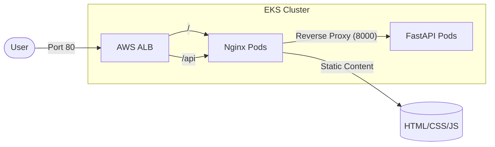

# 🚀 EKS GitOps CI/CD Project

이 프로젝트는 **GitHub Actions**와 **ArgoCD**를 활용하여 AWS EKS 환경에 선언적인 방식으로 애플리케이션을 자동 배포하는 **GitOps 파이프라인** 예제입니다.

---

## 🏗 System Architecture

본 프로젝트는 비용 절감과 보안을 위해 **단일 ALB(Application Load Balancer)** 구조를 채택하고 있습니다.

- **Frontend (Nginx)**: 정적 파일을 서비스하며, `/api/` 경로로 들어오는 요청을 백엔드로 전달하는 리버스 프록시 역할을 수행합니다.
- **Backend (FastAPI)**: 클러스터 내부망(`ClusterIP`)에 숨겨져 있으며, Nginx를 통해서만 통신하여 보안이 강화되었습니다.

---

## 🛠 CI/CD Workflow (GitOps)

모든 인프라와 이미지의 상태는 Git에 의해 관리됩니다.

1.  **Code Push**: 개발자가 `main` 브랜치에 코드를 푸시합니다.
2.  **CI (GitHub Actions)**:
    - 소스 코드를 Docker 이미지로 빌드하고 Amazon ECR에 푸시합니다.
    - 빌드 시 사용된 **Commit SHA**를 태그로 사용하여 `k8s/` 폴더 내의 Manifest 파일을 자동으로 업데이트하고 커밋합니다.
3.  **CD (ArgoCD)**:
    - Git 저장소의 Manifest 변경 사항을 감지합니다.
    - 클러스터의 현재 상태를 Git에 정의된 상태와 동기화(Sync)하여 최신 버전을 배포합니다.

---

## 📂 Project Structure

- `nginx/`: Nginx Dockerfile 및 설정(`default.conf`), 프론트엔드 소스 코드.
- `fastapi/`: FastAPI Dockerfile 및 백엔드 애플리케이션 코드.
- `k8s/`: 쿠버네티스 배포 매니페스트 파일.
  - `nginx-nodeport.yaml`: Nginx Service, Ingress, Deployment 설정.
  - `fastapi-deployment.yaml`: FastAPI Service(ClusterIP), Deployment 설정.
- `.github/workflows/`: GitHub Actions 파이프라인 정의 (Nginx/FastAPI 각각 분리).

---

## 🚀 Getting Started

### 1. GitHub Secrets & Variables 설정
워크플로우가 작동하기 위해 다음 환경 변수가 필요합니다.
- **Secrets**: `AWS_ACCESS_KEY_ID`, `AWS_SECRET_ACCESS_KEY`
- **Variables**: `AWS_REGION`, `ECR_REPOSITORY_NGINX`, `ECR_REPOSITORY_FASTAPI`

### 2. ArgoCD Application 등록
ArgoCD에서 이 리포지토리를 소스로 등록하고, `Prune` 옵션을 활성화하여 Git의 상태와 클러스터 상태를 일치시킵니다.

### 3. Deployment 자동화
- `nginx/` 내부 소스 수정 시 -> Nginx 자동 배포 트리거
- `fastapi/` 내부 소스 수정 시 -> FastAPI 자동 배포 트리거
- Manifest(`k8s/`) 직접 수정 시 -> ArgoCD에 의한 즉시 반영

---

## 🔒 Security Features
- **Zero Exposure**: 백엔드(FastAPI)는 외부 로드밸런서에 직접 노출되지 않으며 오직 클러스터 내부망을 통해서만 접근 가능합니다.
- **Immutable Tags**: `latest` 태그 대신 커밋 해시를 사용하여 배포 버전의 추적성과 롤백 안정성을 보장합니다.